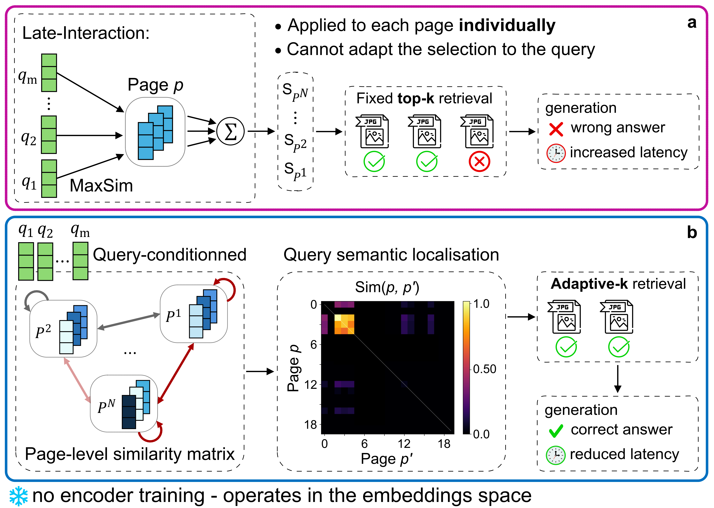

# ViSAR

This repository contains the code used for the paper [ViSAR: Training-Free Adaptive-k Retrieval for Visual Document Question Answering](https://arxiv.org/abs/2609.02486)

## Abstract

Document Visual Question Answering (DocVQA) often leverages Retrieval-Augmented Generation (RAG), where late-interaction encoders are commonly used to identify document pages relevant to a user query, before answer generation by a Large Vision-Language Model (LVLM). Existing approaches typically retrieve a fixed top-k number of pages regardless of query complexity, which increases LVLM latency and may degrade answer accuracy. We introduce ViSAR (Visual Semantic Activation Retrieval), a training-free adaptive-k retrieval method for late-interaction visual document retrieval. ViSAR operates directly in the embedding space to construct a query-conditioned page-level similarity matrix that highlights query-relevant semantics and dynamically determines the number of pages to retrieve. Across multiple encoders and LVLMs, ViSAR retrieves compact, query-adapted page sets that reduce RAG latency by up to 58.7\%, while maintaining or improving answer accuracy compared with fixed top-k and adaptive retrieval heuristics. Furthermore, we show that the similarity matrix structure correlates with answer accuracy, suggesting future directions for retrieval quality-aware document understanding.

## Comparison With Standard Methods

<p align="center">
    
</p>

Document page retrieval mechanisms. (a) Late-interaction fixed top-k. (b) The proposed ViSAR adaptive-k method. While late-interaction enables fine-grained query-page matching using multi-vector representations, it relies on a fixed top-k retrieval that cannot adapt to the query, introducing irrelevant pages and unnecessary latency. ViSAR leverages these multi-vector representations without additional training to enable adaptive-k retrieval, reducing irrelevant pages, lowering latency, and improving answer accuracy.

# Setup

## Main Environment Requirements

- Python 3.12.9
- PyTorch 2.4.0
- CUDA 12.6
- Transformers 4.57.0 (Hugging Face)
- flash_attn 2.7.4.post1

## Setup Instructions

1. Clone this Repository:

    ```bash
    git clone https://github.com/adrienmialland/ViSAR.git
    cd ViSAR
    ```

2. Install Packages

    ```bash
    conda create -n visar python=3.12.9
    conda activate visar
    pip install -r requirements.txt
    ```

3. Data Preparation

- Edit the `./config/config.yaml` file to specify the dataset to use, then extract:

    ```bash
    python ./scripts/extract.py --config config/config.yaml
    ```

- Edit the `./config/config.yaml` file to specify the dataset and the encoder to use, then encode:

    ```bash
    python ./scripts/encode.py --config config/config.yaml
    ```

## How to Run

- Update `./config/config.yaml` for the desired configuration.

- Run ViSAR:

    ```bash
    python ViSAR.py --config config/config.yaml
    ```

- Run evaluation:

    ```bash
    python ./scripts/eval.py --config config/config.yaml [ANALYSES]
    ```

    Available analyses can be combined:

    | Analysis | Flag |
    |---|---|
    | Retrieval | `--retrieval` |
    | Generation | `--generation` |
    | Latency | `--latency` |
    | Sensitivity | `--sensitivity` |
    | Ablation | `--ablation` |

## How to Run Multiple Configurations

The `--sweep` option allows sweeping across multiple *retrieval* configurations:

- Update the sweep section in `./config/config.yaml`.

- Run ViSAR across configurations:

    ```bash
    python ViSAR.py --config config/config.yaml --sweep
    ```

- Run evaluation across configurations:

    ```bash
    python ./scripts/eval.py --config config/config.yaml --sweep [ANALYSES]
    ```

# Citation

If you use this code, please cite:

```text
@article{Mialland2026ViSAR,
  title={ViSAR: Training-Free Adaptive-k Retrieval for Visual Document Question Answering},
  author={Mialland, Adrien and Marc, Plantevit and Julien, Gallois and Céline, Robardet},
  journal={arXiv preprint},
  year={2026}
}
```